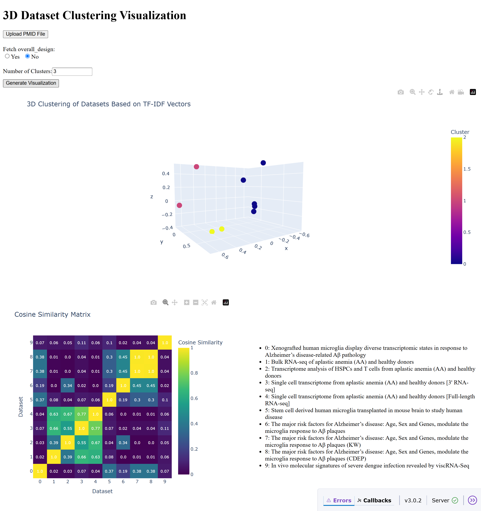

## Download libraries
```
pip install -r requirements.txt
```

## Run webservice
```
python app.py
```

## Usage
1. Upload txt file with PMIDs
2. Select wheter to fetch overall design of datasets
3. Select number of clusters
4. Click Generate Visualization button and wait for the results.
